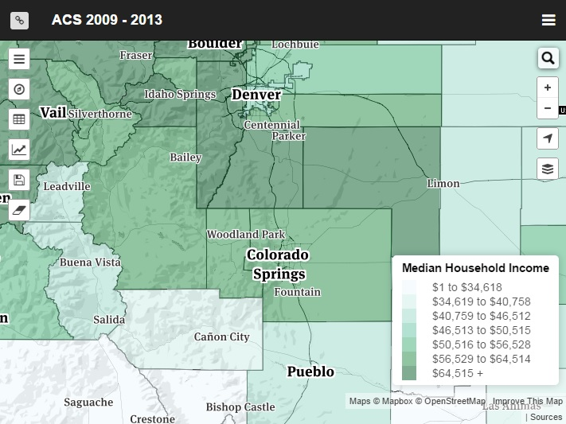

# CensusAPI_Map
The Colorado State Demography Office's US Census Map  

A responsive census map with a database backend.  Full-featured yet simple.  Covers the entire USA.
##Features
####Themes

Map by over 65 characteristics (with more still being added)

####Data Tables

Display attributes in a data table of all selected areas.  Sort by column.  Export to CSV.

####Charts

Compare the characteristics of any geographies

####Custom Symbology

Jenks, Quantile, Standard Deviation.  Any ColorBrewer Scale.

####Database Query

Would you like to know which tracts in Colorado have a Median Family Income of Less than $20,000? (or similar obscure knowledge)?  Check out the advanced tab!

####Mapping Down to the Block Group Level

Supports mapping at the State, County, Place, Tract, or Block Group levels of Geography

####Save / Print Map

Save a map image (minus the control buttons).  Map image is a high quality PNG format at 1024x768 resolution - perfect for PowerPoint presentations.

####Advanced Link Support

You can send a link of any map view to a friend.  They will see the map EXACTLY how you saw it, even if you had a chart open, the datatable maximized, custom classes and symbology, etc

***
